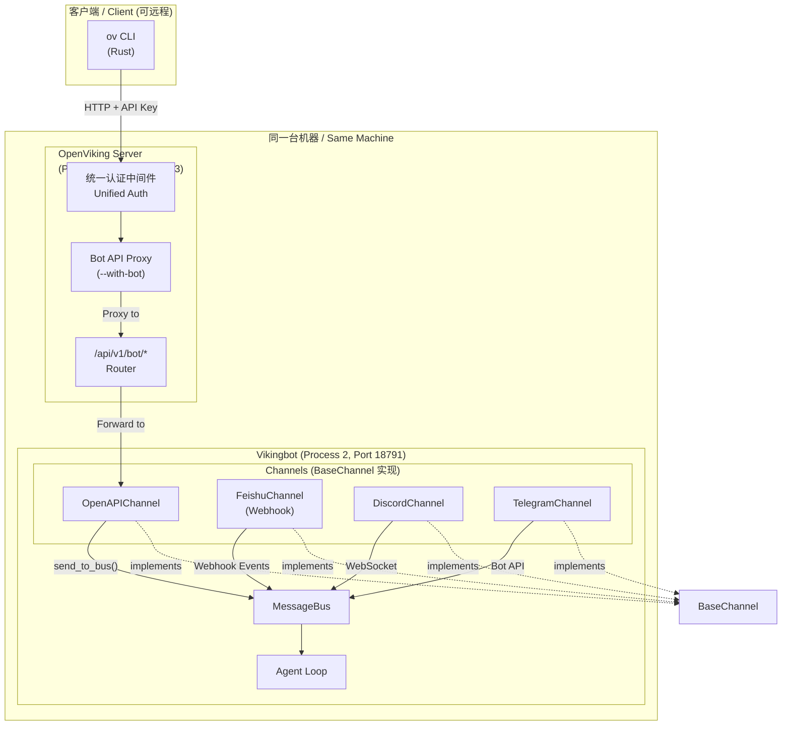
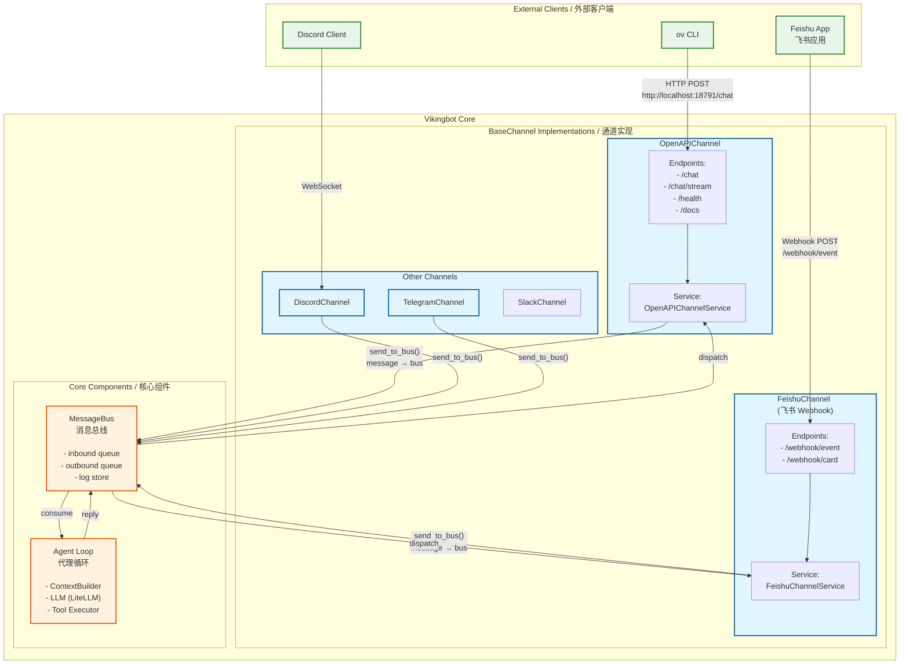

# RFC: OpenViking CLI Support for ov chat Command

**Author:** OpenViking Team
**Status:** Implemented
**Date:** 2025-03-03

---

## 1. Executive Summary / 执行摘要

This document describes the integration architecture between `ov` CLI (Rust), `openviking-server` (Python/FastAPI), and `vikingbot` (Python AI agent framework). The goal is to provide a unified chat interface where the bot service shares the same port and authentication mechanism as the OpenViking server.

本文档描述了 `ov` CLI（Rust）、`openviking-server`（Python/FastAPI）和 `vikingbot`（Python AI agent 框架）之间的集成架构。目标是提供一个统一的聊天界面，使 bot 服务与 OpenViking 服务器共享相同的端口和认证机制。

---

## 2. Architecture Overview / 架构概览

### 2.1 系统整体架构 / System Architecture

**部署说明 / Deployment Note:** OpenViking Server 和 Vikingbot 部署在同一台机器上，通过本地端口通信。



### 2.2 Channel-Bus-Agent 架构详解

展示 Channel 与 MessageBus 的关系，以及各 Channel 如何作为 BaseChannel 实现：



---

## 3. Key Components / 关键组件

### 3.1 OpenViking Server (`openviking-server`)

**Role:** HTTP API Gateway with Bot API proxy / 带 Bot API 代理的 HTTP API 网关

**Key Features / 主要特性：**
- Unified authentication middleware for all endpoints / 为所有端点提供统一认证中间件
- Bot API proxy layer (enabled via `--with-bot`) / Bot API 代理层（通过 `--with-bot` 启用）
- Request forwarding to Vikingbot OpenAPIChannel / 请求转发到 Vikingbot OpenAPI 通道

**Architecture Position / 架构位置：**
- Process 1 (Port 1933) / 进程1（端口 1933）
- Entry point for all external clients (CLI, Feishu, etc.) / 所有外部客户端的入口点

---

### 3.2 `ov` CLI Client (`ov chat`)

**Role:** Command-line chat interface / 命令行聊天界面

**Key Features / 主要特性：**
- Interactive mode and single-message mode / 交互模式和单消息模式
- Configurable endpoint via environment variable / 通过环境变量配置端点
- HTTP POST with JSON request/response / 使用 JSON 请求/响应的 HTTP POST

**Architecture Position / 架构位置：**
- External client layer / 外部客户端层
- Communicates with OpenViking Server (Port 1933) / 与 OpenViking 服务器通信（端口 1933）

---

### 3.3 Vikingbot OpenAPIChannel

**Role:** AI agent framework with HTTP API / 带 HTTP API 的 AI 代理框架

**Key Features / 主要特性：**
- HTTP endpoints for chat, streaming, and health checks / 聊天、流式传输和健康检查的 HTTP 端点
- Integration with MessageBus for message routing / 与 MessageBus 集成进行消息路由
- Support for session management and context building / 支持会话管理和上下文构建

**Architecture Position / 架构位置：**
- Process 2 (Port 18791 default) / 进程2（默认端口 18791）
- Receives proxied requests from OpenViking Server / 接收来自 OpenViking 服务器的代理请求

---

### 3.4 MessageBus and Agent Loop / 消息总线与代理循环

**Role:** Core message routing and processing engine / 核心消息路由和处理引擎

**Components / 组件：**
- **MessageBus / 消息总线:** Inbound queue, Outbound queue, Log store / 入队队列、出队队列、日志存储
- **Agent Loop / 代理循环:** ContextBuilder, LLM (LiteLLM), Tool Executor / 上下文构建器、LLM、工具执行器

**Flow / 流程：**
```
Channel → MessageBus.inbound → Agent Loop → MessageBus.outbound → Channel
```

---

## 4. API Endpoints / API 端点

### 4.1 Bot API (via OpenViking Server)

| Method | Path | Description |
|--------|------|-------------|
| GET | `/api/v1/bot/health` | Health check |
| POST | `/api/v1/bot/chat` | Send message (non-streaming) |
| POST | `/api/v1/bot/chat/stream` | Send message (streaming, SSE) |

### 4.2 Response Codes

| Code | Condition |
|------|-----------|
| 200 | Success |
| 503 | `--with-bot` not enabled or bot service unavailable |
| 502 | Bot service returned an error |

---

## 5. Usage Examples / 使用示例

### 5.1 Start the services / 启动服务

```bash
# 启动 OpenViking Server (带 --with-bot 会自动启动 vikingbot gateway)
openviking-server --with-bot

# Output:
# OpenViking HTTP Server is running on 127.0.0.1:1933
# Bot API proxy enabled, forwarding to http://localhost:18791
# [vikingbot] Starting gateway on port 18791...
```

**说明 / Note:**
- `--with-bot`: 自动在同一机器上启动 `vikingbot gateway` 进程
- 不加 `--with-bot`: 仅启动 OpenViking Server，不会启动 Vikingbot

**设计意图 / Design Rationale:**
OpenViking Server 统一代理 Vikingbot 的 CLI 请求，目的是：
1. **共享鉴权机制** - 复用 OpenViking Server 的统一认证中间件
2. **端口共享** - 服务端部署时可共享端口，简化网络配置

### 5.2 Using `ov chat` CLI / 使用 `ov chat` CLI

```bash
# Interactive mode (default)
ov chat

# Single message mode
ov chat -m "Hello, bot!"

# Use custom endpoint
VIKINGBOT_ENDPOINT=http://localhost:1933/api/v1/bot ov chat -m "Hello!"
```

### 5.3 Direct HTTP API usage / 直接 HTTP API 使用

```bash
# Health check
curl http://localhost:1933/api/v1/bot/health

# Send a message
curl -X POST http://localhost:1933/api/v1/bot/chat \
  -H "Content-Type: application/json" \
  -d '{
    "message": "Hello!",
    "session_id": "test-session",
    "user_id": "test-user"
  }'

# Streaming response
curl -X POST http://localhost:1933/api/v1/bot/chat/stream \
  -H "Content-Type: application/json" \
  -d '{
    "message": "Hello!",
    "session_id": "test-session",
    "stream": true
  }'
```

---

## 6. Configuration / 配置

### 6.1 配置共享说明 / Configuration Sharing

**重要 / Important:** Vikingbot 与 OpenViking Server 共享同一个 `ov.conf` 配置文件，不再使用 `~/.vikingbot/config.json`。

Vikingbot 的配置项统一放在 `ov.conf` 的 `bot` 字段下：

```json
{
  "server": {
    "host": "127.0.0.1",
    "port": 1933,
    "root_api_key": "your-api-key",
    "with_bot": true,
    "bot_api_url": "http://localhost:18791"
  },
  "bot": {
    "agents": {
      "model": "openai/gpt-4o",
      "max_tool_iterations": 50,
      "memory_window": 50
    },
    "gateway": {
      "host": "0.0.0.0",
      "port": 18791
    },
    "channels": [
      {"type": "feishu", "enabled": false, "app_id": "", "app_secret": ""}
    ],
    "sandbox": {
      "backend": "direct",
      "mode": "shared"
    }
  }
}
```

**配置说明 / Configuration Notes:**
- `server.with_bot`: 启用时自动在同一机器上启动 Vikingbot gateway
- `bot.agents`: Agent 配置，包括 LLM 模型、最大工具迭代次数、记忆窗口
- `bot.gateway`: HTTP Gateway 监听地址
- `bot.channels`: 渠道配置列表，支持 openapi、feishu 等
- `bot.sandbox`: 沙箱执行配置

### 6.2 Command-line Options

```bash
# Enable Bot API proxy
openviking-server --with-bot

# Custom bot URL
openviking-server --with-bot --bot-url http://localhost:8080

# With config file
openviking-server --config /path/to/ov.conf
```

---

*End of Document*
