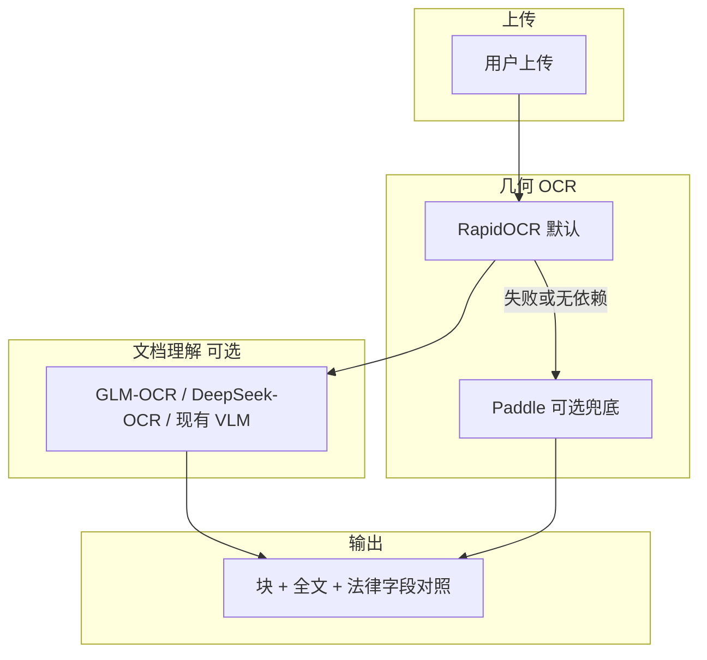

# OCR 栈：RapidOCR + GLM-OCR / DeepSeek-OCR 替代 Apple Vision + Paddle

## Problem Frame

处理法律/聊天**截图与扫描件**时：

- **Apple Vision**在你当前素材上**识别质量不稳定**（乱码、与 RapidOCR 严重不一致）。
- **PaddleOCR**在 Mac CPU 上**过慢**（多模型、Server 档），但作为**最后兜底**仍有价值。

希望在**可接受延迟与成本**下，用 **RapidOCR** 扛主力几何 OCR，并用 **GLM-OCR / DeepSeek-OCR** 类端到端文档模型补足「复杂版式 / 表格 / 公式 / 结构化理解」，**逐步弱化**对 Apple Vision + Paddle 主路径的依赖。

## Requirements

**几何 OCR（字符与行框）**

- **R1.** 默认主力几何 OCR 为 **RapidOCR**（与当前 Makefile/`cross_validate` 主引擎方向一致）；用户无需为「截图中文」再依赖 Apple Vision。
- **R2.** **Apple Vision** 降为**可选**：可通过配置启用为副引擎或关闭；不作为「必须安装才有输出」的前置条件。
- **R3.** **PaddleOCR** 保留为**末级兜底**（Rapid/ONNX 不可用或显式指定时），不要求从默认 happy path 上经过 Paddle。

**文档级 / VLM-OCR 能力**

- **R4.** 将 **GLM-OCR** 与/或 **DeepSeek-OCR** 作为 **VLM 提取路径的候选 provider**（与现有 Gemini / Ollama 并列），用于**整页/结构化块**输出（非逐行 det+rec 的微对齐 second pass）。
- **R5.** 用户可在配置中选择：仅几何 OCR；或「几何 OCR + 指定 VLM-OCR」；不要求一次请求内**强制**跑两套完整 VLM。
- **R6.** 法律场景下，保留现有 **OCR ↔ VLM 关键字段对照**与**双通道一致性**思路；若第二通道变为 VLM-OCR，**对照语义**仍为「几何 OCR 文本 vs VLM 结构化/全文」，不要求与 Rapid 做块级 IoU 互对齐（与双几何引擎 cross_validate 区分开）。

**交叉验证**

- **R7.** **双几何引擎交叉验证**（Rapid × Apple）作为**可选模式**保留，默认不强迫 Apple 参与。
- **R8.** 若引入「Rapid + VLM-OCR」产品线，产品文案与 UI 需区分：**双 OCR 验签** vs **OCR+VLM 法律字段对照**，避免用户误以为第二引擎仍是「另一个框 OCR」。

## Success Criteria

- 在同批**微信/聊天截图**样本上，默认路径的**可读中文与案号/金额可抽取率**不低于当前「Rapid 主 + Apple 副」调整后的基线，且**无需**为提速走完整 Paddle Server 档。
- 用户可在**不安装 Paddle**的前提下完成常见单页/多页流程（在 Rapid + 所选推理后端可用时）。
- 配置中可选择 GLM-OCR / DeepSeek-OCR（或兼容端点）后，**复杂表格/公式页**的主观可用性较「仅 Rapid」有可感知提升（以你方样本验收为准）。

## Scope Boundaries

- **不在本需求内**承诺具体榜单分数或超越某商用 API；以**业务样本**与**人工验收**为准。
- **不在本需求内**强制替换现有所有 CI/文档中对 Paddle 的提及；仅调整**产品默认路径与优先级**。
- **不**要求 GLM-OCR/DeepSeek-OCR 与 RapidOCR 输出**同粒度 bbox 的自动 IoU 合并**；块级对齐仍以几何双引擎模式为限。

## Key Decisions

- **GLM-OCR / DeepSeek-OCR 定位**：优先作为 **VLM 提取/理解通道**（R4），而非第二套「画框 OCR」；与 Rapid 的关系是**互补**（快几何 + 强文档理解），不是 Apple 的 1:1 替代品。
- **Paddle 角色**：保留 **fallback**（R3），不作为默认主链路，以解决「慢」与心智负担。
- **Apple 角色**：**可选副引擎或关闭**（R2），符合你对截图效果的不满。
- **部署形态（已选）**：优先 **Ollama** 跑 GLM-OCR / DeepSeek-OCR（或兼容 OpenAI 的本地端点）；与现有 `vlm.py` Ollama 分支对齐扩展。

## Dependencies / Assumisms

- GLM-OCR / DeepSeek-OCR 在 **Ollama** 上需有可拉取的 **vision 模型**（名称以官方/社区清单为准）；若某模型仅提供云端 API，则规划阶段需标注「Ollama 不可用时的降级」。
- 端到端 VLM-OCR 的**延迟与单价**通常高于 Rapid 单页 OCR；需在规划中定义**何时调用**（全页 vs 按需触发）。

## Outstanding Questions

### Resolve Before Planning

- （已解决）部署形态：**Ollama**。

### Deferred to Planning

- **[Affects R4][Technical]** GLM-OCR 与 DeepSeek-OCR 的请求格式是否与当前 `vlm.py` 的 OpenAI-compat / Ollama / Gemini 分支统一，还是需要单独适配层。
- **[Affects R6][Needs research]** 法律字段对照在「Rapid + VLM-OCR」路径上，提示词与合并策略是否需与「Rapid + Gemini」路径区分。

## Approaches Considered（摘要）

| 方向 | 概要 | 适用 |
|------|------|------|
| **A. Rapid 主 + VLM-OCR 作第二通道** | 几何 OCR 用 Rapid；整页理解/表公式用 GLM/DeepSeek | **推荐**：对齐你现有 VLM 架构 |
| **B. Rapid + VLM-OCR 做块级双验** | 两路都产出 bbox 再 IoU | **不推荐**：VLM-OCR 与 det/ocr 粒度常不一致，工程成本高 |
| **C. 仅 Rapid，去掉所有 Apple/Paddle** | 最简 | **风险**：无网/无 Rapid 模型时缺少兜底；与 R3 冲突 |

## User Flow（概念）

## Next Steps

- 先回答 **Resolve Before Planning** 中的部署形态（云 / 本地 / Ollama / 混合）。
- 随后执行 **`/ce:plan`**，以本文件为输入，规划 `vlm.py` provider、配置 UI、默认引擎与文档更新范围。
